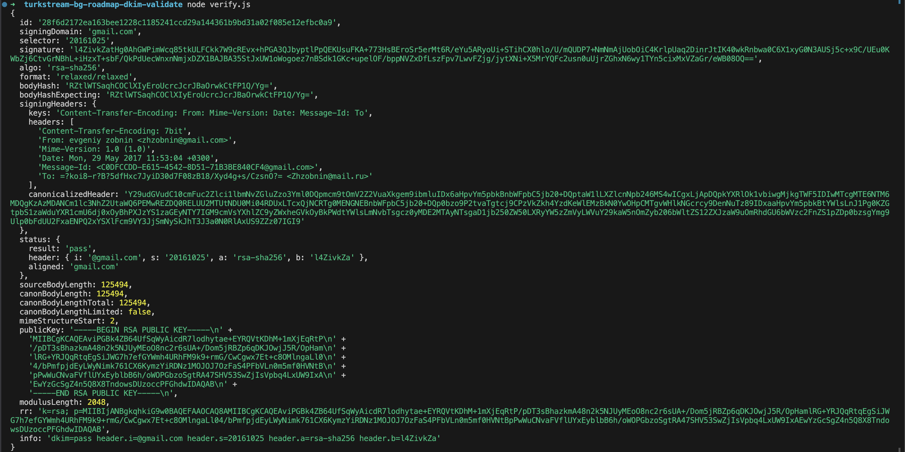
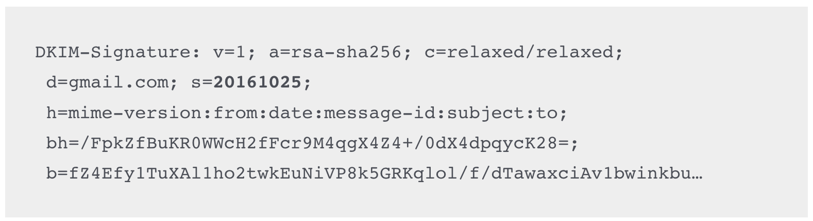

# turkstream-bg-roadmap-dkim

This project paper includes a nodejs library, used to authenticate emails' authenticity 
by validating their DKIM signature against Google's mail server.

Using this process it has been proven that "TURKISH STREAM ROAD MAP" document, found as attachment to this email, is 100% authentic and has been sent 7 years ago from Evgeny Zobnin's mailbox.

## Setup and run

This script requires NodeJS > 16.0

Make sure to install the dependencies:

```bash
# npm
npm install
# run
node verify.js
```


## Result



## Context

In the beginning of 2024, Ukrainian hacktivists from CyberResistance were able to break into the [email inbox of Evgeny Zobnin](https://ordilo.org/damp-e-mail-zhzobninmail-ru-yakyi-nalezhyt-verbuvalnyk/). The information about the leak was spread by InformNapalm. At the end of February 2024, a journalist from InformNapalm contacted BG Elves and asked for help with decrypting a bunch of password protected documents, found as attachment in the emails, where `Bulgaria` was mentioned. Over the last month, BG Elves, together with many investigative journalists worked hard to sort and analyze all the information found in the leak. A special website for the purpose of this analysis was developed - [https://turkstream.exposed/](https://turkstream.exposed/) where all the information about the document "ROAD MAP" and following events can be traced. The website also includes links to sources and passwords to decrypt the included attachment files.

## Intro

The goal of this work is to validate the authenticity of the document found in the leak. Upon our initial examination, we have found that this particular email `Message14960479880043215677.eml`, that includes the "ROAD MAP" as an attachment, was sent from the private Gmail account of Zobnin to his mail.ru, and the email includes a DKIM signature.

## FAQ

### "What precisely was validated?"

What the signature in this email validates:
- it was sent from this specific account - `zhzobnin@gmail.com`, private   email account, known to have been owned and used by Evgeny Zobnin, assistant of Alexander Babakov
- the intended recipient was to the account `zhzobnin@mail.ru`,
  known to have been owned and used again by Evgeny Zobnin for work
- that it was sent on Mon, 29 May 2017 11:53:04 +0300
- the `Subject:`, the `body` and `the attached file` have not been altered in any way

### "How can I replicate this?"

There's a NodeJS lib included, that'll do the validation for you. The purpose of this library is to demonstrate how the DomainKeys Identified Mail (DKIM) signature works and can be validated, using only open source code and information. At the bottom of this paper, we also include references to sources, that can allow you to experiment with different programming languages, techniques or ideas on how to do the same validation, following the DKIM standard.

Once you've replicated that the email do verify with the signature, try to change it and see if it is still valid. Change it, change the signature. Hack away. Find some way that verification can happen with forged/altered email file.

### "The entire email dump verified or just this one?"

We've validated many emails. But in this paper, we are only focusing on the one that includes the attached document "ROAD MAP".

Also, many can't be validated. They were sent from domains that don't use DKIM to sign outgoing emails. Others used DKIM when sent, but we can no longer find the public-keys that would authenticate them (it's been years).

### "Can't signatures be faked, replayed, forged, or cheated?"

Not cryptographic signatures, at least, not in any practical/reasonable manner.

They use a mathematical trick of **public-key crypto** where a pair of matching keys are generated. Something signed with the **private-key**, can only be verified by the matching **public-key**.

### "Okay, you've verified the metadata, but couldn't the contents of the body of the email be changed?"

The signature covers both the metadata and the body. The slightest change invalidates the signature. Even a single bit, will invalidate the signature! In the SMTP protocol used to transfer an email content, the attached file is part of the body. So the attachment is also part of the signature.

### "Is it timestamped?"

The `Date:` field in the headers/metadata is included in the signature.
DKIM verifies the contents of that field (that somebody didn't alter after signing).

There are other timestamps in the email headers/metadata, but they aren't
validated by DKIM, and hence, could be forged.

### "But GMail's DNS servers no longer provide the public-key"

This is indeed a problem -- for most email domains that aren't GMail.

But in this case, because GMail is so popular, there are thousands of sources of the old key, including archives of old sites, log files from servers, and so on.

Thus, in theory the system only works when the domain in question is currently providing the public-key to validate signatures, but in practice we can know GMail's old key even if they don't provide it directly.

The domain key used to verify this email is also included in this project, but of course, we could be lying. You can validate that we are using the authentic public key of GMail by googling the key, searching archives like Archive.org, or by specialty logging sites that have retained copies of the old key. Use the search terms `20161025` or `20161025._domainkey.google.com`. For your convenience, you can find it [in this Cisco document](https://www.cisco.com/c/en/us/support/docs/security/secure-email-gateway/217073-how-to-use-dig-nslookup-to-find-spf-dki.html) as well.



### "My DKIM verifier can only fetch the key from a DNS server"

Yes, that's a problem. Other DKIM verification tools and libraries can grab the key from a file, so you could try that ([like this one](https://gist.github.com/stevecheckoway/51e63d4c269bd2be4a50a3b39645a77c)).

Our work includes a parametrized lib, that can handle a manual TXT record, instead of getting the one directly from DNS. It is demonstrated in the main `verify.js` file.

But you are more then welcome to try it using real DNS! What we did instead was set up BIND9 as DNS resolver, then configured
a "Response Policy Zone" (RPZ) with this one record changed. This means
that we'll provide live resolution for any other names, but overwrite
the correct response (of "not found") with the old key that we retrieved.

Overriding certain records in a resolver this way is pretty common practice. If you manage your own DNS server already, you can easily update it to provide the correct public-key.

### "So the Email is real, but the account could be fake, by someone **claiming** to be Zobnin."

Yup, that's possible. We've only proven *a* Evgeny Zobnin sent the email,
not that *the* Evgeny Zobnin sent it. It's somebody who, in 2017, claimed
to have been "Evgeny Zobnin".

But the fact that this email is also part of a leak, containing more than 5000 emails, many of which contain passports, bank cards, travel invoices including flying tickets, private house schemas, many private videos and photos does tell us a lot about who was operating those accounts. It is in fact Evgeny Zobnin.

We also have more proofs in that matter, but at this point, we are unable to present them. Anyone looking for more clues, is more than welcome to look into the original leak or follow the channels of InformNapalm and CyberResistance.

### "How did you see that secret metadata, in a debugger?"

In some cases, metadata in files like photographs require special tools. But emails are just text, even the metadata. You can open them in any text editor. Just click on this [source link](https://github.com/bg-elves/turkstream-bg-roadmap-dkim/blob/main/Message14960479880043215677.eml)
and see for yourself.

### "Short DKIM keys can be cracked."

When GMail first started DKIM signing, they used 1024 bit RSA keys. These are short enough that a nation state (like Russia) can crack them.

But since 2012, they've been [using 2048 bit RSA keys](https://superuser.com/questions/507752/computing-number-of-bits-in-public-key), 
which even all the nation states working together cannot crack in a lifespan.

Note: that link is also yet another source verifying an old GMail public _domainkey.

### "Did you get this email from the laptop? or was it sent to you?"

The email was initially retrieved by CyberResistance and later shared by InformNapalm. We have found the email file, after looking into the leaked documents, already made available publicly, upon request by journalists.

During our analysis, we have established communication with both CyberResistance and InformNapalm, who gave us insights of the process being used to retrieve the inbox contents, which we wont share. Based on those traces we performed a series of lab experiments on the content, validating not just the crypto signature, but also to verify the exact steps that Evgeny Zobnin performed, when he sent himself this email. What type of device and software for managing his inbox and much more, that describes in precise details how did this document got into the public space.

# Sources and credits:

This paper was made possible mainly because of the work of CyberResistance and InformNapalm, who shared the leaked emails.

Many thanks to [momchilmg](https://github.com/momchilmg/verify-dkim-signature) and [fakedob](https://github.com/fakedob) who conducted the analysis, performed all lab experiments and finally were able to validate the DKIM signature and authored this work.

Thanks to [postalsys](https://github.com/postalsys) for their work on [mailauth](https://github.com/postalsys/mailauth) which source code was used to create this project and also [youdecidetimes](https://github.com/youdecidetimes) for writing his paper on [hunter-biden](https://github.com/youdecidetimes/hunter-biden) which helped us prepare our own README paper.

Also we want to mention dr. Tristan Jenkinson, whose work [Nothing’s DKIMpossible – Manually Verifying DKIM, a CTF Solution, and Implications](https://ediscoverychannel.com/2021/02/28/nothings-dkimpossible-manually-verifying-dkim-a-ctf-solution-and-implications/) gave us a lot of inspiration and ideas on how to perform the validation process.

# Слава україні и да живее България!